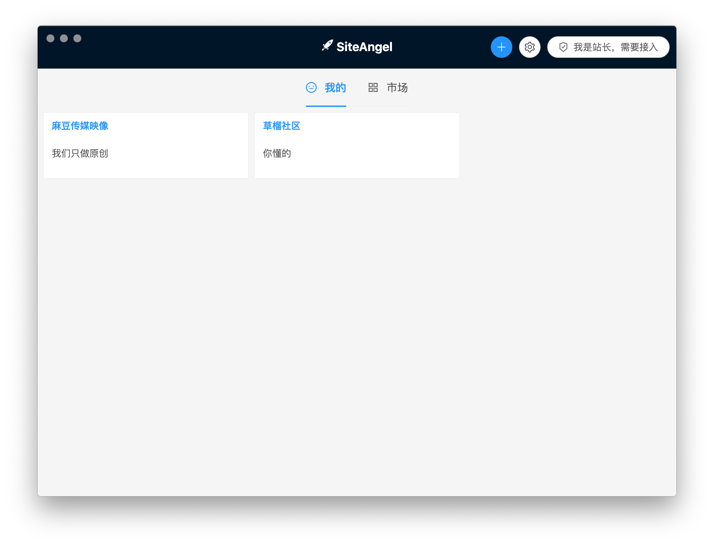

## 关于SiteAngle
SiteAngle 可以让您的网站永久可被访问，再也没必要更换域名了，丢失好不容易推广得到的流量了。

## 使用说明
### 站长
+ 准备好一个专门给SiteAngle使用的域名，不可透露在互联网上；
+ 联系sepzero@yandex.com获取域名token；
+ 下载SiteAngle客户端，点击右上角创建网站证书；
+ 在您的网站页面创建类似 [/guide](/guide)的引导页面，让您的网站用户按步骤操作；

### 网友
+ 复制网站提供的证书内容；
+ 下载SiteAngle客户端，点击最下面的“**+**”按钮，添加证书；
+ 点击创建的网站，使用浏览器访问；
